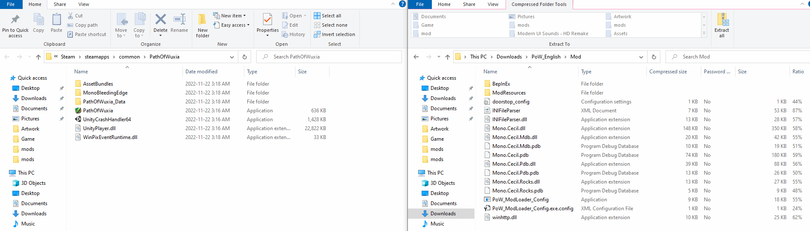

# Path Of Wuxia ModLoader + English Patch

Join our discord! 
https://discord.com/invite/PH4Z4Dn

Update notifications, direct contact to report issues and a great community to chat about the game with.

# How to Install
Grab the latest release and just extract the content of the PoW_English.zip file into the games folder.
If you installed steam and the game in their default locations the path should be: ```C:\Program Files (x86)\Steam\steamapps\common\PathOfWuxia```.



Your folder should now look like this:


Now just start the game over Steam and enjoy!

# Technical

If you want to build the mod yourself you can just clone this repository and build it by opening the .sln file with Visual Studio and just pressing F5.
You will find a working release ready build in Output/Mod.
To get the newest Translation as well as updating the translation sheet to the newest game version, the PoW_Tool_SheetUtils Tool automates everything.
To use it you need access to the translation sheets as well as a configured google cloud accounts.
Access is given over our discord, so if you want to contribute contactus in the discord server.

BepInEx is used as the actual underlying ModLoader.
This repository contains a ModAPI plugin containing base functionalities for other Mods and Plugins.
It currently allows dynamic registration of external Asset folders, which allows several mods to register asset overrides.
It also supports modifying textures inside prefabs, though that is experimental

Additionally this repository contains the EnglishPatch Plugin, which registers Mods/EnglishTranslate as a resource folder (So place the translated Asset files into Mods/EnglishTranslate) as well as fixing several issues with displaying the English Text in the game.

If BepInEx is updated/replaced by a new version it is important to update the BepInEx.cfg and replace the following Entry.

```ini
[Preloader.Entrypoint]

## The local filename of the assembly to target.
# Setting type: String
# Default value: UnityEngine.CoreModule.dll
Assembly = UnityEngine.CoreModule.dll

## The name of the type in the entrypoint assembly to search for the entrypoint method.
# Setting type: String
# Default value: Application
Type = Object

## The name of the method in the specified entrypoint assembly and type to hook and load Chainloader from.
# Setting type: String
# Default value: .cctor
Method = .cctor
```

otherwise the Entrypoint will be too late and some language files are already loaded.

-------------------------------------------

The dependency folder contains parts of the game and unitys assembly since they are needed for plugins.
I do not hold any copyright to any file inside the Dependency folder.
